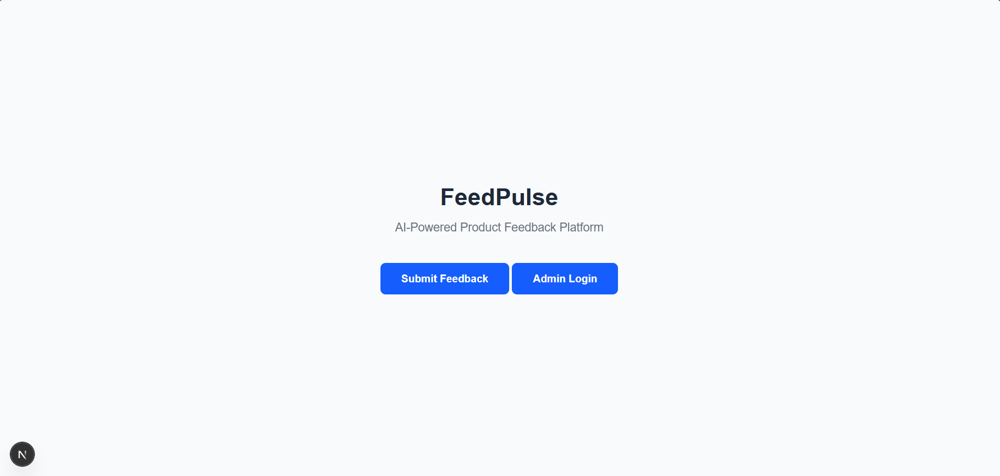
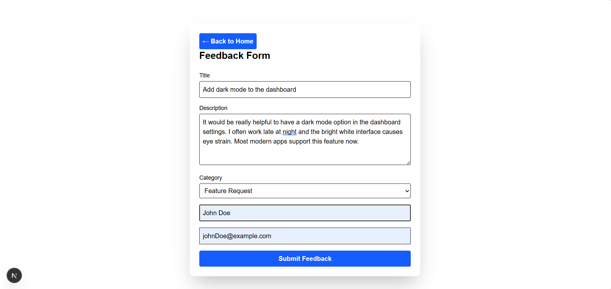
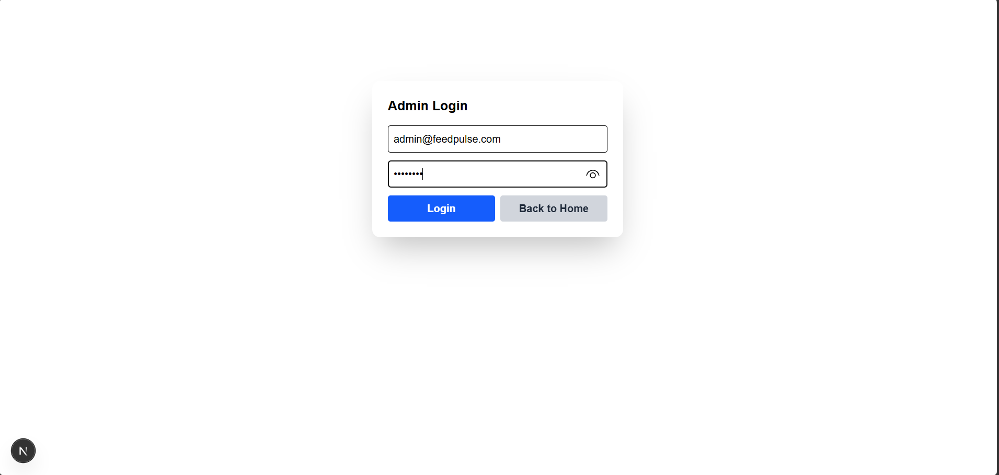
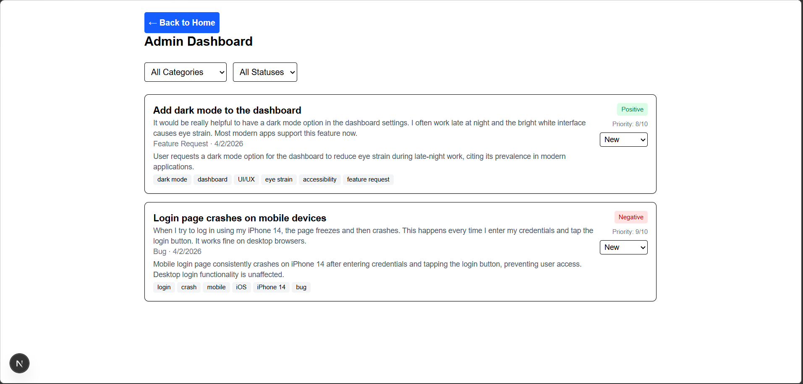

# FeedPulse
> AI-Powered Product Feedback Platform

FeedPulse is a lightweight internal tool that lets teams collect product feedback and feature requests from users, then uses Google Gemini AI to automatically categorize, prioritize, and summarize them — giving product teams instant clarity on what to build next.

---

## Screenshots

### Home page


### Feedback submission form


### Admin Login Page


### Admin Dashboard


---

## Tech Stack

### Frontend
Next.js 14+, TypeScript, Tailwind CSS

### Backend
Node.js, Express, TypeScript

### Database
MongoDB, Mongoose

### AI
Google Gemini 2.5 Flash (Google Gemini 1.5 no longer available)

### Testing
Jest, Supertest, ts-jest

---

## Features

### Must Have
- Public feedback submission form
- Client-side form validation
- AI analysis using Google Gemini (category, sentiment, priority, summary, tags)
- Graceful AI error handling — feedback saves even if AI fails
- Admin dashboard protected by JWT authentication
- Filter feedback by category and status
- Update feedback status (New → In Review → Resolved)
- Full REST API with consistent JSON responses
- MongoDB schema with indexes for performance
- Environment variables for all secrets

### Nice to Have
- Rate limiting — max 5 submissions per IP per hour

### Bonus
- Unit testing with Jest and Supertest (11 passing tests)

---

## Project Structure

```
FeedPulse-Application/
├── frontend/                   ← Next.js app
│   ├── app/
│   │   ├── page.tsx            ← Home page
│   │   ├── feedback/
│   │   │   └── page.tsx        ← Public feedback form
│   │   ├── admin/
│   │   │   └── page.tsx        ← Admin login
│   │   └── dashboard/
│   │       └── page.tsx        ← Admin dashboard
│   └── ...
│
├── backend/                    ← Node.js + Express API
│   ├── src/
│   │   ├── config/
│   │   │   └── env.ts          ← Environment variables
│   │   ├── controllers/
│   │   │   ├── auth.controller.ts
│   │   │   └── feedback.controller.ts
│   │   ├── lib/
│   │   │   └── db.ts           ← MongoDB connection
│   │   ├── middleware/
│   │   │   └── auth.middleware.ts
│   │   ├── models/
│   │   │   └── Feedback.model.ts
│   │   ├── routes/
│   │   │   ├── auth.routes.ts
│   │   │   └── feedback.routes.ts
│   │   ├── services/
│   │   │   └── gemini.service.ts  ← AI integration
│   │   ├── tests/
|   |   |   └── __mocks__/
|   |   |       └── gemini.service.ts
│   │   │   ├── app.ts
│   │   │   ├── setup.ts
│   │   │   └── feedback.test.ts
│   │   └── index.ts            ← Entry point
│   └── ...
│
└── README.md
```

---

## API EndPoints

|--------|--------------------|-----------------------|
| Method | EndPoint           |   Description         |
|--------|--------------------|-----------------------|
|POST    | `/api/auth/login`  |Admin login            |
|POST    | `/api/feedback`    |Submit new Feedback    |
|GET     | `/api/feedback`    |Get All Feedbacks      |
|GET     | `/api/feedback/:id`|Get Feedback By Id     |
|PATCH   | `/api/feedback/:id`|Update Feedback Status |
|DELETE  | `/api/feedback/:id`|Delete Feedback        |
|--------|--------------------|-----------------------|

---

## How to run locally

### Prerequisites
- Node.js 18+
- MongoDB (https://www.mongodb.com/atlas)
- Google Gemini API Key (https://aistudio.google.com)

### 1. Clone the repository
```bash
git clone https://github.com/GK-18268-GIT/FeedPulse-Application
cd FeedPulse-Application
```

### 2. Set up the Backend
```bash
cd backend
npm install
```

Create a `.env` file inside the `backend/` folder:
```
PORT=5000
CLIENT_URL=http://localhost:3000
MONGODB_URL=your_mongodb_connection_string
GEMINI_API_KEY=your_gemini_api_key
JWT_SECRET_KEY=your_jwt_secret_key
ADMIN_EMAIL=admin@feedpulse.com
ADMIN_PASSWORD=admin123
```
Start the backend:
```bash
npm run dev
```

Backend runs at: `http://localhost:5000`

### 3. Set up Frontend
Open a new terminal:

```bash
cd frontend
npm install
```

Create a `.env.local` file inside the `frontend/` folder:

```
NEXT_PUBLIC_API_URL=http://localhost:5000
```

Start the frontend:

```bash
npm run dev
```

Frontend runs at: `http://localhost:3000`

### 4. Access the app

|-----------------|---------------------------------|
| Page            |             URL                 |
|-----------------|---------------------------------|
| Home            | http://localhost:3000           |
| Feedback Form   | http://localhost:3000/feedback  |
| Admin Login     | http://localhost:3000/admin     |
| Admin Dashboard | http://localhost:3000/dashboard |
|-----------------|---------------------------------|

Admin credentials:
```
Email:    admin@feedpulse.com
Password: admin123
```

---

## Environment Variables

### Backend (`backend/.env`)

|------------------|-----------------------------|
| Variable         |         Description         | 
|------------------|-----------------------------|
| `PORT`           | Port for the backend server | 
| `CLIENT_URL`     | Frontend URL for CORS       |
| `MONGODB_URL`    | MongoDB connection string   |
| `GEMINI_API_KEY` | Google Gemini API key       |
| `JWT_SECRET_KEY` | Secret key for JWT tokens   |
| `ADMIN_EMAIL`    | Admin login email           |
| `ADMIN_PASSWORD` | Admin login password        |
|------------------|-----------------------------|

### Frontend (`frontend/.env.local`)

|-----------------------|-----------------|
|       Variable        | Description     |
|-----------------------|-----------------|
| `NEXT_PUBLIC_API_URL` | Backend API URL |
|-----------------------|-----------------|

---

## Running Tests

```bash
cd backend
npm test
```
Expected Output:
```
 PASS  src/tests/feedback.test.ts (10.197 s)
  POST /api/auth/login
    √ should login with valid credentials (1055 ms)
    √ should not login with invalid credentials (112 ms)
    √ should not login with missing credentials (112 ms)
  POST /api/feedback
    √ should create a feedback with valid data (260 ms)                                                                                        
    √ should not create a feedback with empty data (112 ms)                                                                                    
    √ should not create a feedback with missing required fields (107 ms)                                                                       
  GET /api/feedback - auth protected                                                                                                           
    √ should reject the request without token (127 ms)                                                                                         
    √ should reject the request with invalid token (111 ms)                                                                                    
    √ should allow the request with valid token (330 ms)                                                                                       
  PATH /api/feedback/:id                                                                                                                       
    √ should update feedback status (356 ms)
    √ should return 404 for not found feedback (299 ms)                                                                                        

Test Suites: 1 passed, 1 total                                                                                                                 
Tests:       11 passed, 11 total                                                                                                               
Snapshots:   0 total
Time:        11.257 s, estimated 16 s
```

---

## What I Would Build Next

Given more time, here is what I would add to FeedPulse:

- **Email notifications** — notify the submitter when their feedback status changes
- **Weekly AI summary** — auto-generate a "Top 3 themes from the last 7 days" report for the product team
- **Charts and analytics** — visualize feedback trends over time using a charting library
- **Multi-user admin roles** — support multiple admin accounts
- **Docker support** — containeriZe the app for easier deployment

## License

MIT